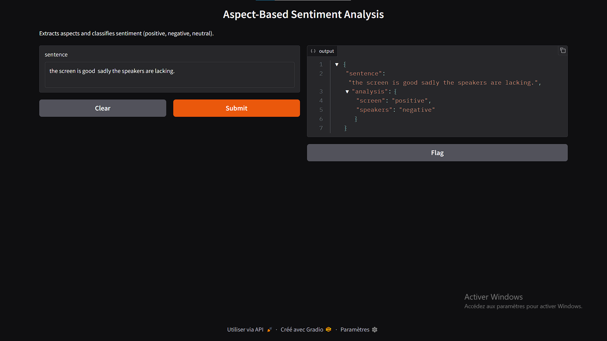

# 📝 Aspect-Based Sentiment Analysis (ABSA)

This project implements an **Aspect-Based Sentiment Analysis (ABSA)** pipeline with two models:
* **Aspect Term Extraction (ATE)** → extracts key aspects from a sentence (e.g., *battery life*, *screen*, *speakers*).
* **Aspect Sentiment Classification (ASC)** → determines the sentiment (*positive*, *negative*, *neutral*) towards each extracted aspect.

The project exposes a **FastAPI backend** and a **UI demo** (using Gradio).

## ⚙️ 1. Setup

### Clone & Install dependencies

```bash
git clone <your-repo>
cd <your-repo>
pip install -r requirements.txt
```

### requirements.txt

```txt
torch
transformers
fastapi
uvicorn
gradio
```

## 📚 2. Models

We use **two Hugging Face models**:

1. **ATE model** (Aspect Term Extraction)
   * Loads from `../models/ate_model`
   * A token classification model (`AutoModelForTokenClassification`).

2. **ASC model** (Aspect Sentiment Classification)
   * Loads from `../models/asc_model/checkpoint-885`
   * A sequence classification model (`AutoModelForSequenceClassification`).

## 🧠 3. Pipeline

### 🔹 Extract Aspects

```python
def extract_aspects(text):
    tokens = ate_tokenizer(text.split(), is_split_into_words=True, return_tensors="pt")
    with torch.no_grad():
        outputs = ate_model(**tokens)
    predictions = torch.argmax(outputs.logits, dim=2)
    # … parse tokens into aspect terms
```

### 🔹 Classify Sentiment

```python
def classify_sentiment(sentence, aspect):
    inputs = asc_tokenizer(sentence, aspect, return_tensors="pt", truncation=True, padding=True)
    with torch.no_grad():
        outputs = asc_model(**outputs)
    predicted_class = outputs.logits.argmax(dim=-1).item()
    label_map = {1: "negative", 2: "neutral", 3: "positive"}
    return label_map[predicted_class]
```

## 🚀 4. FastAPI Backend

We wrapped the pipeline inside a **FastAPI** endpoint:

```python
from fastapi import FastAPI
from pydantic import BaseModel
from main import extract_aspects, classify_sentiment

app = FastAPI()

class RequestBody(BaseModel):
    sentence: str

@app.post("/analyze")
async def analyze(req: RequestBody):
    aspects = extract_aspects(req.sentence)
    results = {asp: classify_sentiment(req.sentence, asp) for asp in aspects}
    return {"sentence": req.sentence, "analysis": results}
```

### Run the server:

```bash
uvicorn app:app --reload
```

### Test with:

```bash
curl -X POST "http://127.0.0.1:8000/analyze" \
     -H "Content-Type: application/json" \
     -d '{"sentence": "The screen is bright but the speakers are disappointing."}'
```

### Response:

```json
{
  "sentence": "The screen is bright but the speakers are disappointing.",
  "analysis": {
    "screen": "positive",
    "speakers": "negative"
  }
}
```

## 🎨 5. Demo UI with Gradio

We built a **Gradio web app** for easy demo & presentation:

```python
import gradio as gr
from main import analyze_sentence

def predict(sentence):
    return analyze_sentence(sentence)

demo = gr.Interface(
    fn=predict,
    inputs=gr.Textbox(lines=2, placeholder="Type a sentence..."),
    outputs="json",
    title="Aspect-Based Sentiment Analysis",
    description="Extracts aspects and classifies sentiment."
)

if __name__ == "__main__":
    demo.launch(server_name="0.0.0.0", server_port=7860)
```

### Run:

```bash
python demo.py
```

**Open in your browser:** 👉 http://localhost:7860

## 🖼️ 6. Screenshot



## ✅ Example Sentences to Try

* `"I love using AI models to learn new things."`
* `"The battery life is amazing but the screen is too dim."`
* `"The design is sleek, but the performance is terrible."`

## 📁 Project Structure

```
project-root/
├── main.py              # Core ABSA pipeline
├── app.py               # FastAPI backend
├── demo.py              # Gradio UI
├── requirements.txt     # Dependencies
├── models/
│   ├── ate_model/       # Aspect Term Extraction model
│   └── asc_model/       # Aspect Sentiment Classification model
└── README.md           # This file
```

## 🔧 Usage

1. **Extract aspects and analyze sentiment programmatically:**
   ```python
   from main import analyze_sentence
   
   result = analyze_sentence("The camera quality is excellent but battery drains quickly.")
   print(result)
   # Output: {'camera quality': 'positive', 'battery': 'negative'}
   ```

2. **Use the REST API:**
   ```bash
   # Start the FastAPI server
   uvicorn app:app --reload
   
   # Make requests to http://127.0.0.1:8000/analyze
   ```

3. **Launch the demo interface:**
   ```bash
   python demo.py
   # Visit http://localhost:7860
   ```

## 🤝 Contributing

Feel free to open issues or submit pull requests to improve this project!

## 📄 License
